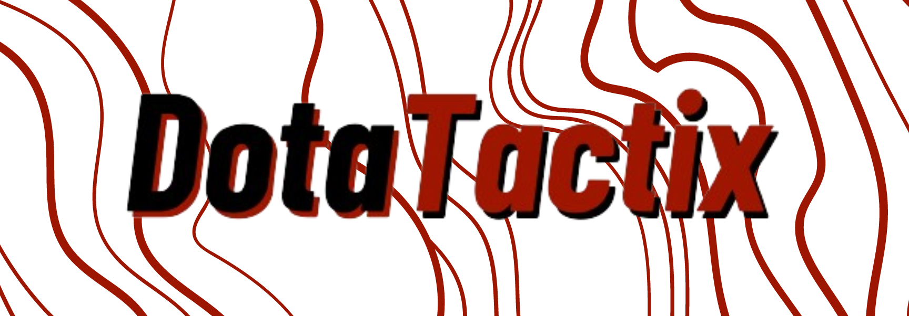
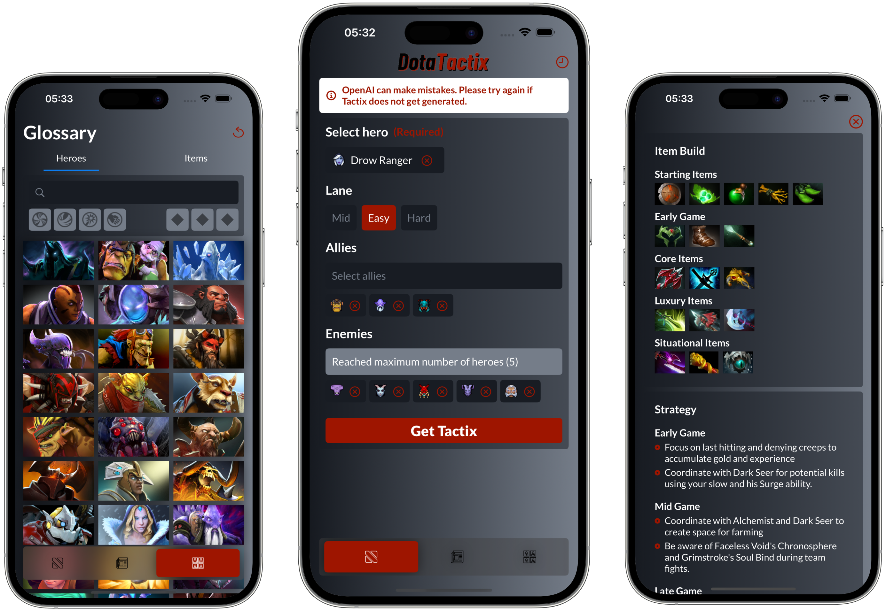

    

    

# DotaTactix - AI-powered build & strategy generator

    

DotaTactix is your ultimate companion app crafted for Dota 2 enthusiasts, offering a wealth of features to elevate your gameplay to new heights.
Leverage the power of OpenAI to generate personalized item builds and strategic approaches tailored to your playstyle. Craft winning strategies that suit your preferences and stay steps ahead of your opponents.
Stay up-to-date with the dynamic world of Dota 2. Dotatactix delivers real-time news straight from the Dota universe, including the freshest patch updates. Never miss a beat, and adapt your tactics swiftly with the latest changes.
Dive deep into the Dota 2 realm with an extensive glossary featuring detailed information about heroes and items.

## Video Demo

    

## Environment Variables

To run this project, you will need to create `OpenAI-Info.plist` wtih the variable below and add it to `DotaTactix` folder

| Key             | Value                                                      | 
| --------------- | -----------------------------------------------------------------| 
| `API_KEY`       | API Key generated from OpenAI | 

## Color Reference

| Color             | Light Mode                                                       |
| ----------------- | -----------------------------------------------------------------|
| Accent Color     |  #9E1500 |
| Dark Gray     |  #181C23 |
| Light Gray    |  #757D89 |

## Features

- **XCode 15 & iOS17**
- **MVVM**
    - Implemented MVVM architecture with API work done in a Service
- **Core Data**
    - Saving all AI-generated tactics using Core Data and displaying them in a list
- **Combine**
    - Fetching data, notifying ViewModels, and updating the data using Combine
- **File Manager**
    - Fetching data from APIs and storing JSON files in the document directory
    - Retrieve data from the saved files if they exist
- **Custom App Icon**
- **Custom Display Name**
- **Swift Modern Concurrency** - async/await, URLSession
- **Error Handling**
    - Throwing custom errors during API calls and displaying them in UI
- **Animations**
    - Done with `withAnimation`
- **Animated Splash Screen**
- **TabView** - Home, News/Updates, Glossary
    - Custom animated TabView with 3 tabs
- **Tactix Generator**
    - Created a form with autocomplete and validation
    - Sending requests to OpenAI and retrieving JSON
    - Storing all generated tactics in Core Data
- **News/Updates**
    - Retrieving news data from an API
    - Implemented WKWebView with controls to show the latest game updates
- **Glossary**
    - Fetching data from 2 different APIs and combining it into one source of data
    - Implemented sorting, filtering, and grouping of items
    - Added Details page for each hero

## API Reference

- https://stratz.com/
- https://www.opendota.com/
- https://steamcommunity.com/dev
- https://platform.openai.com/
